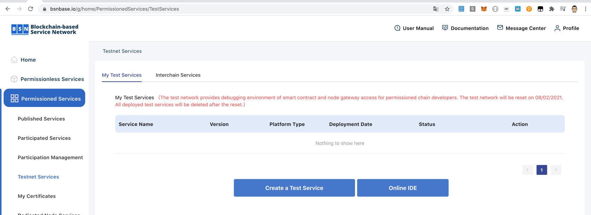
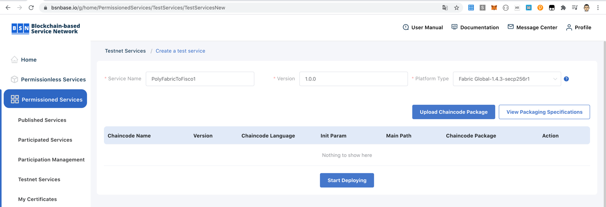
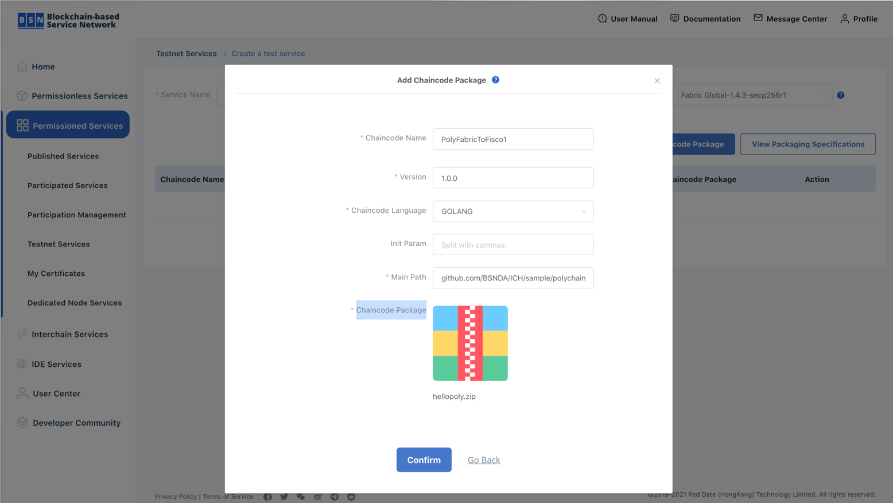
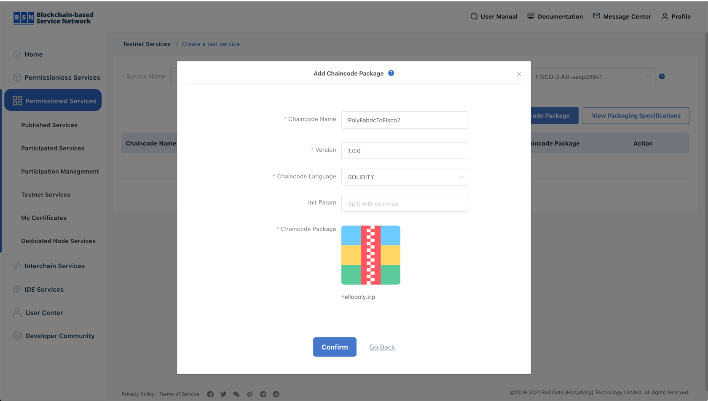

See: https://www.youtube.com/watch?v=jd0lnLyluXE&t=763s

# Testnet Service の作成
Permissioned Services > Testnet Services



# fabricのchaincodeのアップロード

Chaincodeのビルド
```
make build-chaincode-fabric
```

アップロード時のフォームの設定
```
Chaincode Name: PolyFabricToFisco1
Version: 1.0.0
Chaincode Language: GOLANG
Main Path: github.com/BSNDA/ICH/sample/polychain/fabric-contract/testnet
Chaincode Package: ./build/fabric/hellopoly.zip
```




# fiscoのchaincodeのアップロード

※ fabricと同じ手順でServiceを作っておく。

Chaincodeのビルド
```
make build-chaincode-fisco
```


アップロード時のフォームの設定
```
Chaincode Name: PolyFabricToFisco2
Version: 1.0.0
Chaincode Language: SOLIDITY
Chaincode Package: ./build/fisco/hellopoly/hellopoly.zip
```

